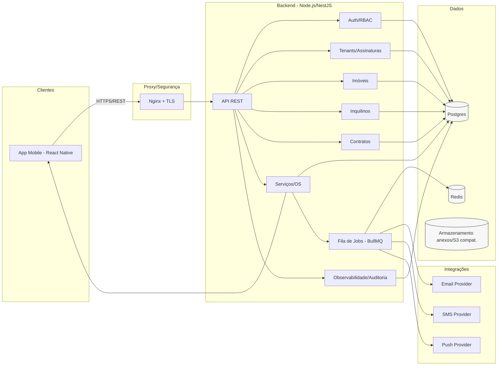

# Fluxograma Arquitetural Atual — Sistema de Gestão de Locações (SaaS)

Notas:
- Fluxos síncronos via REST/HTTPS; assíncronos via fila BullMQ/Redis.
- Isolamento multi-tenant no Postgres (RLS) e camada de serviço.
- Notificações podem usar WebSocket/Push; emails/SMS via provedores externos.