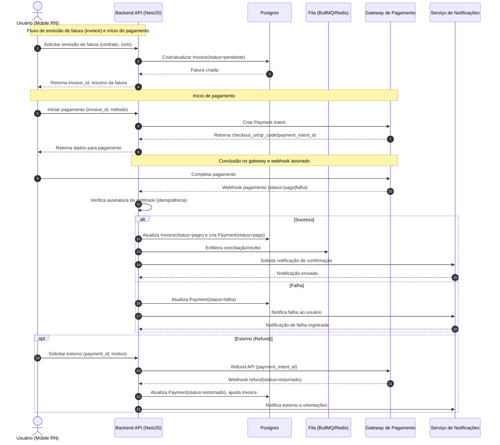
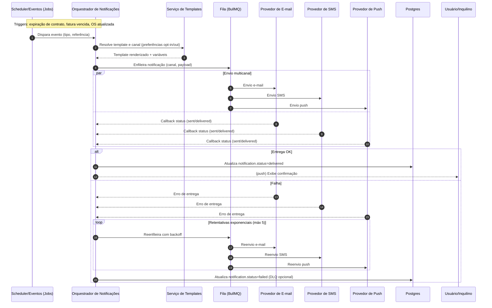

# Fluxograma Detalhado — Pagamentos, Notificações e ERD

## 1) Sequência — Processos de Pagamento



## 2) Sequência — Notificações (E-mail, SMS e Push)



## 3) ERD — Modelo de Dados (Mermaid)

```mermaid
erDiagram
  %% Entidades principais com tipos (Postgres) e PK
  TENANT {
    uuid id PK
    text nome
    text plano
    text status
    timestamptz created_at
    timestamptz updated_at
  }

  USER {
    uuid id PK
    uuid tenant_id
    text role  %% SuperAdmin|Usuario|Inquilino
    text email
    text password_hash
    boolean ativo
    timestamptz created_at
  }

  PROPERTY {
    uuid id PK
    uuid tenant_id
    text endereco
    jsonb atributos
    timestamptz created_at
  }

  PERSON {
    uuid id PK
    uuid tenant_id
    text tipo  %% Inquilino
    text nome
    text documento
    timestamptz created_at
  }

  PROPERTY_PERSON {
    uuid id PK
    uuid tenant_id
    uuid property_id
    uuid person_id
    text vinculo
    timestamptz created_at
  }

  CONTRACT {
    uuid id PK
    uuid tenant_id
    uuid property_id
    uuid person_id
    date start_date
    date end_date
    text status  %% ativo|suspenso|encerrado
    jsonb termos
    jsonb anexos
    timestamptz created_at
  }

  INVOICE {
    uuid id PK
    uuid tenant_id
    uuid contract_id
    numeric valor
    date vencimento
    text status  %% pendente|pago|cancelado|vencido
    text ciclo
    timestamptz created_at
  }

  PAYMENT {
    uuid id PK
    uuid tenant_id
    uuid invoice_id
    text metodo  %% boleto|cartao|pix
    text status  %% pago|falha|estornado|pendente
    text gateway_ref
    text recibo_url
    timestamptz created_at
  }

  SERVICE_ORDER {
    uuid id PK
    uuid tenant_id
    uuid contract_id
    text tipo
    numeric custo
    text status  %% aberta|aprovada|executando|concluida
    timestamptz created_at
  }

  NOTIFICATION {
    uuid id PK
    uuid tenant_id
    text canal  %% email|sms|push
    text template_id
    text status  %% queued|sent|delivered|failed
    uuid target_user_id
    uuid target_person_id
    jsonb metadata
    timestamptz created_at
  }

  ACCOUNT_BILLING {
    uuid id PK
    uuid tenant_id
    text plano
    text ciclo  %% mensal
    jsonb limites
    timestamptz created_at
  }

  ACCOUNT_INVOICE {
    uuid id PK
    uuid account_billing_id
    numeric valor
    date vencimento
    text status  %% pendente|pago|cancelado|vencido
    text metodo
    timestamptz created_at
  }

  %% Relacionamentos e cardinalidades
  TENANT ||--o{ USER : possui
  TENANT ||--o{ PROPERTY : possui
  TENANT ||--o{ PERSON : possui
  TENANT ||--o{ CONTRACT : possui
  TENANT ||--o{ INVOICE : possui
  TENANT ||--o{ PAYMENT : possui
  TENANT ||--o{ SERVICE_ORDER : possui
  TENANT ||--o{ NOTIFICATION : possui
  TENANT ||--o{ ACCOUNT_BILLING : assina
  ACCOUNT_BILLING ||--o{ ACCOUNT_INVOICE : fatura

  %% Associação N:N via tabela de junção
  PROPERTY ||--o{ PROPERTY_PERSON : vincula
  PERSON ||--o{ PROPERTY_PERSON : vincula

  %% Contratos vinculam imóvel e inquilino
  PROPERTY ||--o{ CONTRACT : contrata
  PERSON ||--o{ CONTRACT : contrata

  %% Faturas e pagamentos por contrato
  CONTRACT ||--o{ INVOICE : gera
  INVOICE ||--o{ PAYMENT : liquida

  %% Ordens de serviço no contexto do contrato
  CONTRACT ||--o{ SERVICE_ORDER : gera
```

### Notas ERD (explicativas)
- Multi-tenant: todas as entidades possuem `tenant_id`; aplicar RLS no Postgres para isolamento.
- `PROPERTY_PERSON` representa a relação N:N entre imóveis e inquilinos, permitindo histórico de alocações.
- `CONTRACT` vincula `PROPERTY` e `PERSON`; garantir integridade com FKs e restrições de período.
- `INVOICE` e `PAYMENT` seguem idempotência via `gateway_ref` e reconciliação assíncrona.
- `NOTIFICATION` pode apontar para `target_user_id` ou `target_person_id` conforme público.
- `ACCOUNT_BILLING` e `ACCOUNT_INVOICE` tratam a assinatura SaaS separadamente do contrato de locação.

## 4) Legenda e Convenções
- Cardinalidades Mermaid ERD:
  - `||` exatamente um; `o|` zero ou um; `}|` um ou mais; `o{` zero ou muitos.
- Sequência (Mermaid):
  - `alt/else` ramos; `opt` opcional; `par` paralelismo; `loop` repetição; `Note over` anotação.
- Tipos de dados: mapeados para Postgres (`uuid`, `text`, `numeric`, `date`, `timestamptz`, `jsonb`, `boolean`).
- Status e enums: documentados como texto; implementar como enums/constraints no banco.

## 5) Exemplos de Payloads (JSON)

Pagamento — iniciar checkout (`POST /payments/initiate`):
```json
{
  "invoice_id": "c1f9c0f2-4b7e-4c1a-8a77-9d2f3f3b1a10",
  "method": "pix",
  "callback_url": "https://api.saas.com/payments/webhook",
  "metadata": { "tenant_id": "a0f1-...", "source": "mobile" }
}
```

Pagamento — resposta de início:
```json
{
  "payment_intent_id": "pi_12345",
  "checkout_url": "https://gateway.com/checkout/pi_12345",
  "qr_code": "0002012636...5204000053039865802BR5913...",
  "expires_at": "2025-11-20T12:00:00Z"
}
```

Gateway — webhook de confirmação:
```json
{
  "event": "payment.updated",
  "payment_intent_id": "pi_12345",
  "status": "paid",
  "amount": 2500.00,
  "currency": "BRL",
  "signature": "sha256=...",
  "reference": { "invoice_id": "c1f9c0f2-...", "tenant_id": "a0f1-..." }
}
```

Pagamento — estorno (`POST /payments/refund`):
```json
{
  "payment_id": "5bf3a2e1-...",
  "reason": "duplicate_charge",
  "note": "Cliente cobrado em duplicidade"
}
```

Notificação — enfileirar envio:
```json
{
  "channel": "email",
  "template_id": "invoice_overdue",
  "recipient": { "email": "user@example.com" },
  "variables": { "nome": "João", "valor": 2500.00, "vencimento": "2025-11-10" },
  "tenant_id": "a0f1-...",
  "reference": { "invoice_id": "c1f9c0f2-..." }
}
```

Notificação — callback de status do provedor:
```json
{
  "message_id": "msg_789",
  "status": "delivered",
  "provider": "email_provider_x",
  "timestamp": "2025-11-19T10:15:00Z",
  "metadata": { "attempt": 1, "latency_ms": 180 }
}
```

---

Este arquivo é inteiramente versionável e editável; os blocos Mermaid podem ser renderizados diretamente por ferramentas compatíveis (ex.: VS Code, GitHub, docs estáticos) para visualização dos diagramas.